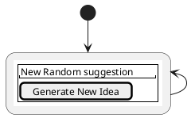

# Drawing Idea Generator

A simple web tool to show ideas for artists to draw randomly chosen from a set of features (who, what, where, how, etc.).
> Example: A troll riding a bike on the Mars.

## Stack

* Python, FastApi
* PostgreSQL
* VueJs, Vuetify
* AWZ

## Main requirements

### Functional

- Provide random ideas for drawing (features and values)
- Admin can manage features and values
- 

### Non-Functional 

- Simple to use
- Visually attractive
- 

### As a anonymous user, I want to get a random drawing suggestion 

asd

```plantuml
@startsalt
{
  Login    | "MyName   "
  Password | "****     "
  [Cancel] | [  OK   ]
}
@endsalt
```

